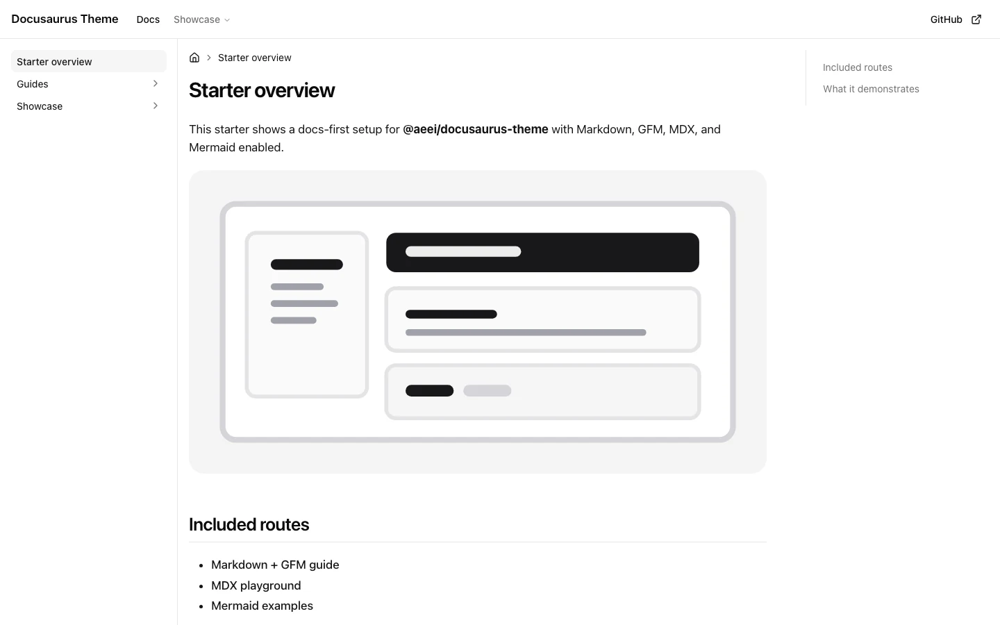

<h1 align="center">@aeei/docusaurus-theme</h1>

<p align="center">A compiled shadcn Base Nova theme for Docusaurus documentation.</p>

<p align="center">
  <a href="https://www.npmjs.com/package/@aeei/docusaurus-theme"></a>
  <a href="./LICENSE"></a>
  <a href="https://aeei.github.io/docusaurus-theme/"></a>
</p>

<picture>
  <source media="(prefers-color-scheme: dark)" srcset=".github/assets/theme-dark.webp">
  
</picture>

## Features

- shadcn `4.12.0` Base Nova components backed by [Base UI](https://base-ui.com/)
- official Neutral light/dark tokens, Geist, Geist Mono, and Lucide
- responsive GNB, sticky/collapsible LNB, TOC, paginator, and footer
- Markdown, GFM, MDX, admonitions, tabs, code blocks, and [Mermaid](https://mermaid.js.org/)
- optional build-time local search or Algolia DocSearch
- optional page-level Markdown copy/view using the official Base Nova `ButtonGroup`
- compiled CSS; consumers need no Tailwind or Sass configuration
- SSR-safe responsive layout and keyboard/focus behavior

## Install

```bash
npm install @aeei/docusaurus-theme \
  @docusaurus/core @docusaurus/plugin-content-docs \
  @docusaurus/preset-classic @docusaurus/theme-common
```

Minimal configuration:

```ts
// docusaurus.config.ts
import type { Config } from "@docusaurus/types";

const config: Config = {
  presets: ["classic"],
  themes: ["@aeei/docusaurus-theme"],
  themeConfig: {
    colorMode: {
      defaultMode: "light",
      disableSwitch: false,
      respectPrefersColorScheme: true,
    },
    docs: {
      sidebar: {
        hideable: true,
        autoCollapseCategories: false,
      },
    },
  },
};

export default config;
```

The package ships Base Nova tokens, fonts, preflight, animations, and compiled theme CSS. Consumer Tailwind/Sass config is neither required nor read.

## Search

Search is disabled by default.

### Local search

```ts
themes: [["@aeei/docusaurus-theme", { search: "local" }]];
```

Each production build extracts rendered Markdown/MDX routes into `build/search-index.json`. The browser fetches that same-origin index only when search opens. Protect the index behind the same auth/network boundary as private docs.

### Algolia

```ts
themes: [["@aeei/docusaurus-theme", { search: "algolia" }]],
themeConfig: {
  algolia: {
    appId: process.env.ALGOLIA_APP_ID,
    apiKey: process.env.ALGOLIA_SEARCH_API_KEY,
    indexName: process.env.ALGOLIA_INDEX_NAME,
  },
},
```

Use a public Search API key, never an Admin API key.

## Copy Page

The visual control is theme-native Base Nova. Markdown route generation is delegated to [`docusaurus-plugin-copy-page-button`](https://github.com/portdeveloper/docusaurus-plugin-copy-page-button); its injected UI is disabled.

```bash
npm install docusaurus-plugin-copy-page-button
```

```ts
plugins: [
  [
    "docusaurus-plugin-copy-page-button",
    { injectButton: false, generateMarkdownRoutes: true },
  ],
],
themes: [
  ["@aeei/docusaurus-theme", { copyPage: true }],
],
```

The primary action copies the generated Markdown. The menu can view the `.md` route or copy its link. External AI actions are intentionally excluded for private-doc safety.

## Mermaid

```bash
npm install @docusaurus/theme-mermaid @mermaid-js/layout-elk
```

```ts
markdown: { mermaid: true },
themes: ["@docusaurus/theme-mermaid", "@aeei/docusaurus-theme"],
```

## Starter

[`examples/docs-starter`](./examples/docs-starter) is the live-demo source and a copyable docs-first starter. Routine authors edit:

```text
docs/**/*.md
docs/**/*.mdx
static/**
```

- [Markdown and GFM](./examples/docs-starter/docs/guides/markdown-gfm.md)
- [Search and Copy Page](./examples/docs-starter/docs/guides/search.md)
- [MDX components](./examples/docs-starter/docs/showcase/mdx-playground.mdx)
- [Mermaid diagrams](./examples/docs-starter/docs/showcase/mermaid.md)

## Development

```bash
yarn install
yarn workspace @aeei/docusaurus-theme build
yarn workspace @aeei/docs-starter start
```

Production smoke:

```bash
yarn workspace @aeei/docusaurus-theme build
yarn workspace @aeei/docs-starter build
```

## Publishing to npm

Maintainers only, after explicit visual approval:

```bash
yarn workspace @aeei/docusaurus-theme build
cd packages/docusaurus-theme
npm pack --dry-run
npm publish --access public
```

Requirements:

- npm account authorized for the `@aeei` scope
- npm login/2FA completed
- package version not already published
- theme build, starter build, isolated tarball build, Jest, TypeScript/LSP, Playwright, and visual evidence passing

Consumers then install a pinned release:

```bash
npm install @aeei/docusaurus-theme@0.1.7
```

This repository does not publish automatically from an unapproved working tree.

## Attribution

This repository is a modified fork of [PaloAltoNetworks/docusaurus-openapi-docs](https://github.com/PaloAltoNetworks/docusaurus-openapi-docs). It is maintained independently and is not an official Palo Alto Networks project.

See [`THIRD_PARTY_NOTICES.md`](./THIRD_PARTY_NOTICES.md) and package `LICENSES/` for Docusaurus, shadcn/ui, Base UI, Lucide, Mermaid, Geist, animation, and upstream notices.

## License

[MIT](./LICENSE). Existing upstream copyright and permission notices are preserved.
