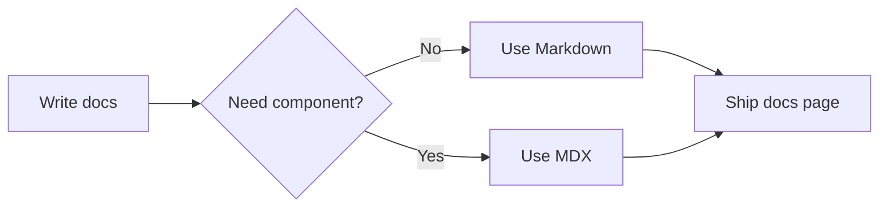
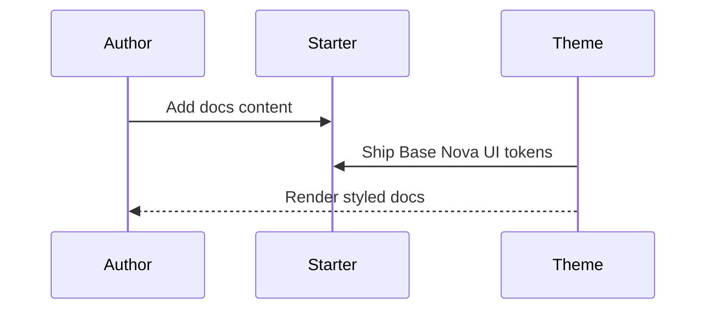
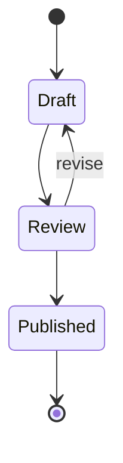

# Mermaid examples

## Flowchart

```mermaid
flowchart LR
  A[Write docs] --> B{Need component?}
  B -->|No| C[Use Markdown]
  B -->|Yes| D[Use MDX]
  C --> E[Ship docs page]
  D --> E
```

## Sequence

```mermaid
sequenceDiagram
  participant Author
  participant Starter
  participant Theme
  Author->>Starter: Add docs content
  Theme->>Starter: Ship Base Nova UI tokens
  Theme-->>Author: Render styled docs
```

## State

```mermaid
stateDiagram-v2
  [*] --> Draft
  Draft --> Review
  Review --> Published
  Review --> Draft: revise
  Published --> [*]
```
